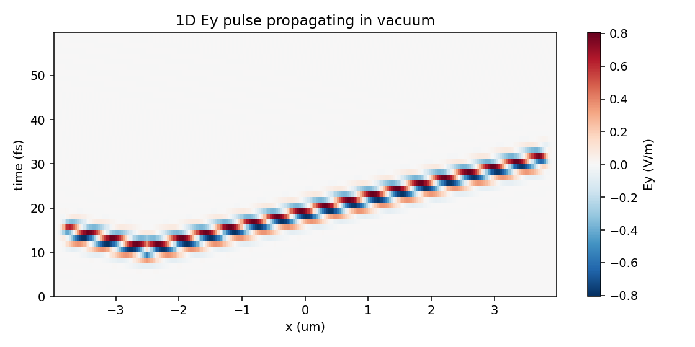
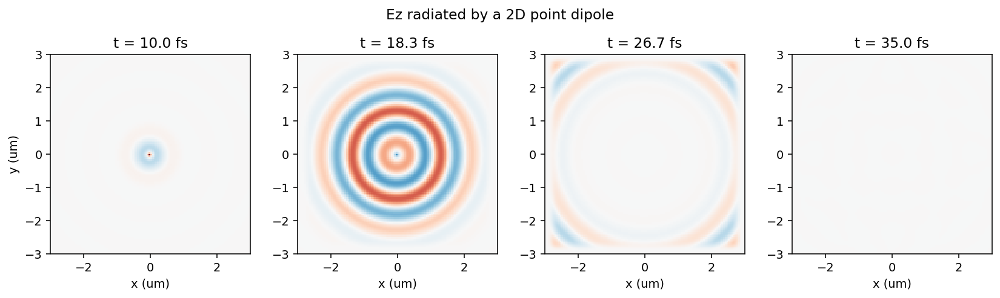
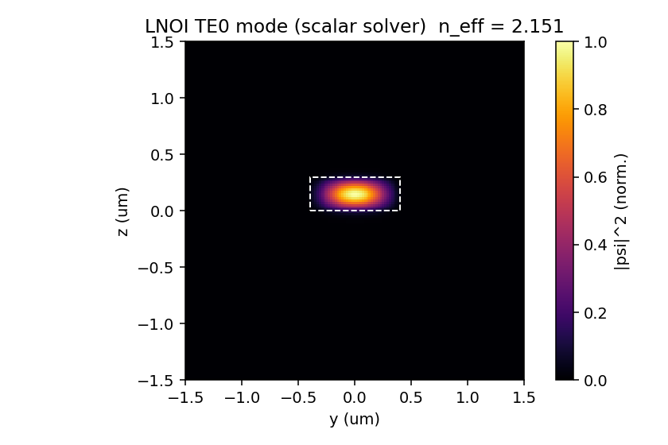
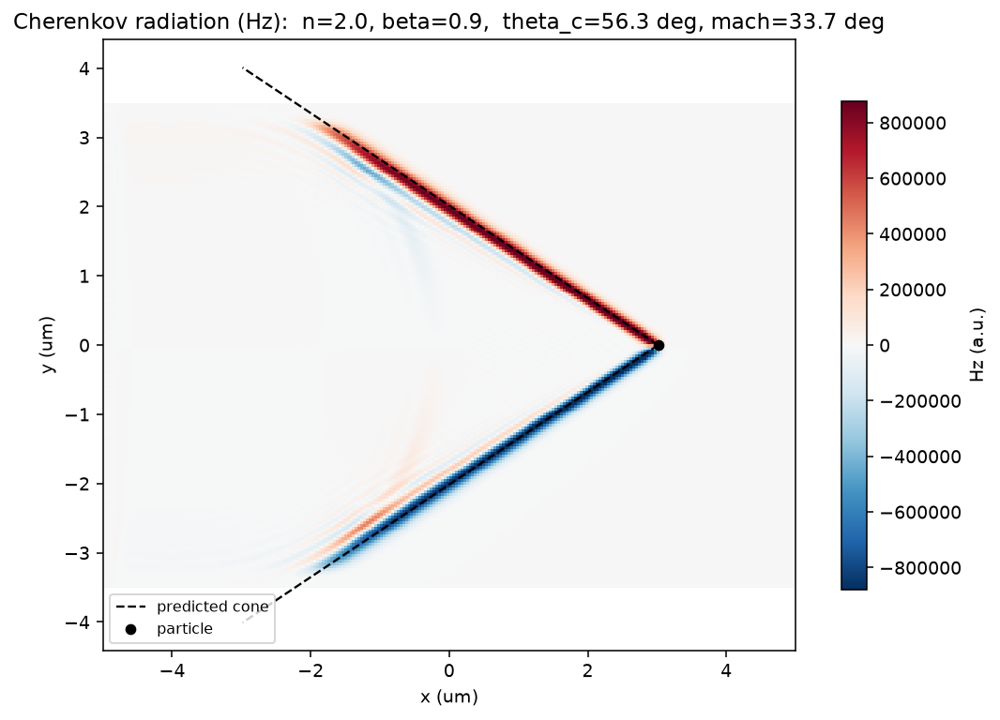

Tutorial: worked examples
=========================

The ``examples/`` directory in the repository holds four self-contained,
runnable scripts. Together they walk from a one-dimensional pulse up to a
moving charge radiating a Cherenkov cone, introducing one new piece of the API
at each step. Each script saves the figure shown below; run them with, e.g.::

   cd examples
   python 01_1d_vacuum_pulse.py

The figures here were produced by exactly these scripts.

.. contents:: On this page
   :local:
   :depth: 1

1. A pulse in 1D vacuum
-----------------------

The smallest useful simulation: a :class:`~photonfdtd.GaussianPulse` driven onto
a single :class:`~photonfdtd.PointDipole`, propagating along a 1-D
:class:`~photonfdtd.Grid` and absorbed at both ends by the CPML boundary. A
:class:`~photonfdtd.FieldMonitor` snapshots ``Ey`` every few steps, and the
result is drawn as a space-time (``x`` vs ``t``) diagram - the bright diagonal
streak is the pulse travelling at ``c``, fading as it enters the PML.

This introduces the core objects you will use in every run: ``Grid``,
``GaussianPulse``, ``PointDipole``, ``FieldMonitor`` and
:class:`~photonfdtd.Simulation`.

   ``Ey`` as a function of position (horizontal) and time (vertical). The
   diagonal slope is the propagation speed; the streak vanishes at the edges
   where the CPML absorbs it.

.. literalinclude:: ../examples/01_1d_vacuum_pulse.py
   :language: python
   :linenos:

2. A point dipole radiating in 2D
---------------------------------

The same ingredients in two dimensions. A ``z``-polarised dipole at the centre
of an ``xy`` domain emits cylindrical waves; CPML on all four sides absorbs
them. Here the ``FieldMonitor`` records at chosen *times* (rather than a fixed
interval) so we can show several snapshots of the expanding wavefronts.

   Four snapshots of ``Ez`` as the cylindrical wave expands from the dipole.

.. literalinclude:: ../examples/02_2d_dipole.py
   :language: python
   :linenos:

3. Solving a waveguide mode
---------------------------

A different tool: the 2-D scalar :class:`~photonfdtd.ModeSolver`. Instead of
time-stepping, it solves an eigenvalue problem for the guided modes of a
refractive-index cross-section - here a lithium-niobate (LNOI) strip on an
oxide box. Media are defined with :class:`~photonfdtd.Medium` and stamped onto
the cross-section with :class:`~photonfdtd.Box`; the solver returns the
effective indices and the transverse field profiles.

   The fundamental TE-like mode profile and its effective index.

.. literalinclude:: ../examples/03_lnoi_mode.py
   :language: python
   :linenos:

4. Cherenkov radiation from a charged particle
----------------------------------------------

Finally, a moving source. A :class:`~photonfdtd.ChargedParticle` is fired
through a dielectric faster than the local phase velocity ``c/n``; because it
outruns its own field, it radiates a Cherenkov shock cone - the electromagnetic
analogue of a sonic boom. The script overlays the analytic Mach cone
(``arcsin(1/(n*beta))``) on the simulated ``Hz``; the two coincide.

   ``Hz`` from a charge moving at ``0.9 c`` through ``n = 2``. The dashed lines
   are the predicted cone half-angle; the simulated shock front lies on them.

.. literalinclude:: ../examples/04_cherenkov.py
   :language: python
   :linenos:
